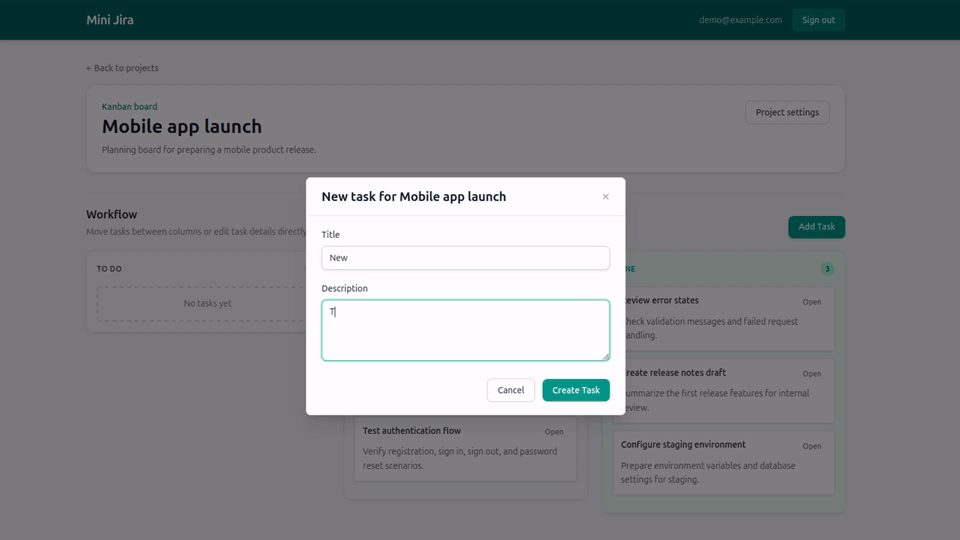
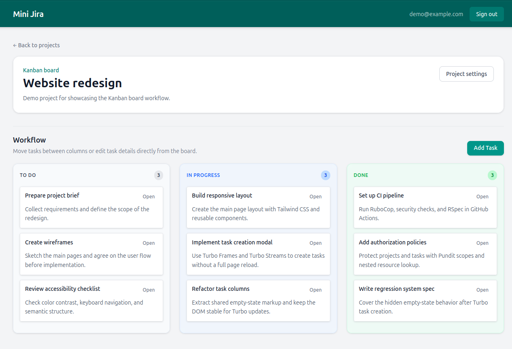
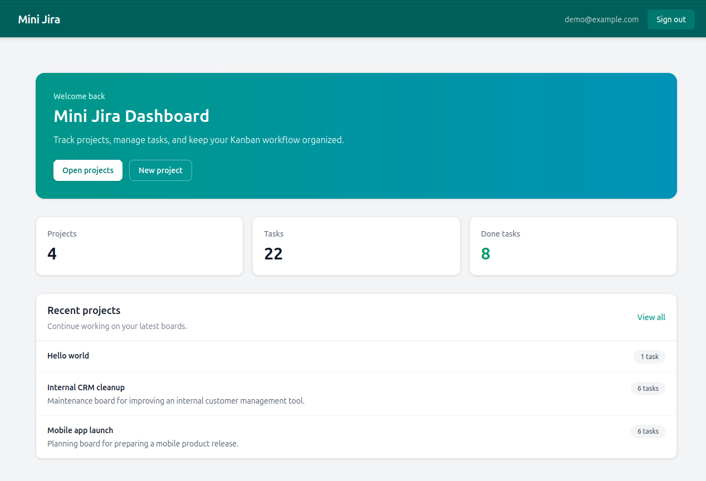
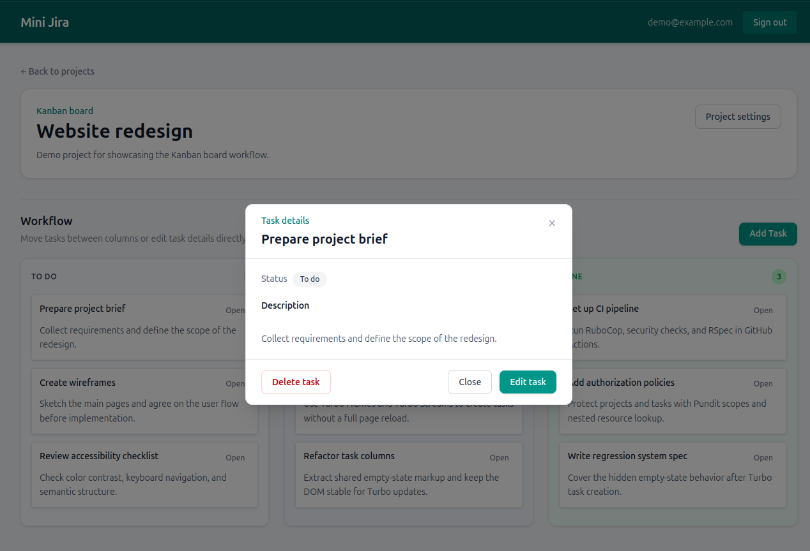
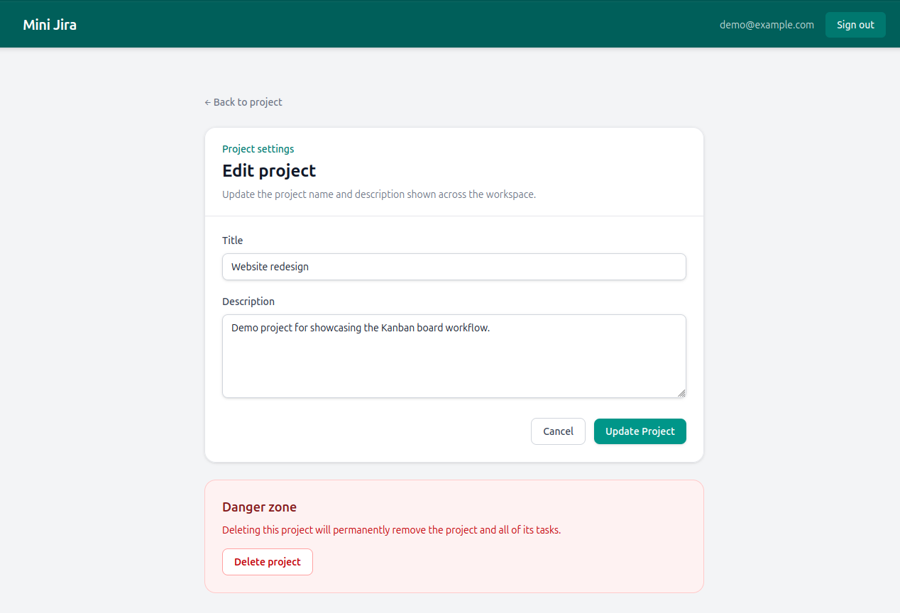
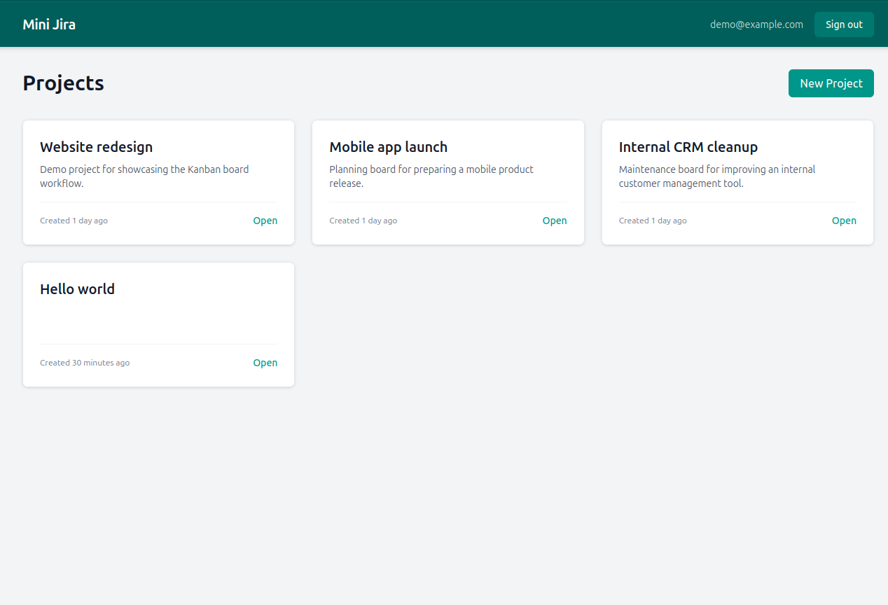
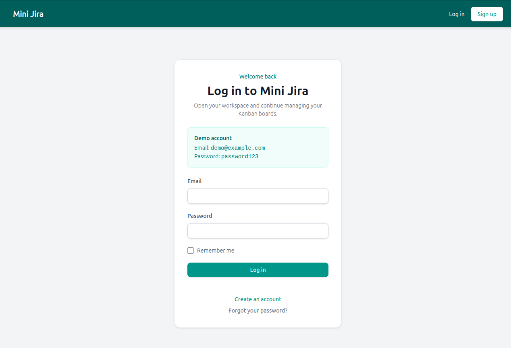

# Mini Jira — Rails 8 SaaS Kanban Board

Mini Jira is a portfolio Ruby on Rails application inspired by Jira/Trello-style Kanban workflows.

The goal of this project is not just to implement CRUD, but to demonstrate production-oriented backend and full-stack engineering practices: authentication, authorization, IDOR protection, service objects, request/system tests, Hotwire interactions, ViewComponents, PostgreSQL, Docker-based development, CI security checks, background jobs, task movement audit trail, and deployment readiness.

## Demo preview

### Task movement demo



### Kanban board



### Workspace dashboard



### Task details modal



### Project settings and danger zone



### Projects overview



### Sign in with demo account



## What this project demonstrates

- Ruby on Rails 8 application structure
- Authentication with Devise
- Authorization with Pundit
- IDOR protection through policy scopes and nested resource lookup
- Kanban-style task management
- Hotwire/Turbo-powered modal interactions
- Stimulus-powered task movement between Kanban columns
- Task movement audit trail with actor and status transition history
- ViewComponent-based UI decomposition
- Service objects with explicit Result objects
- PostgreSQL-backed application data
- Background email delivery with Active Job and Solid Queue
- RSpec test suite: request, model, policy, service, system, and component specs
- Remote Selenium setup for stable Docker/CI system specs
- Docker-based local development and test environment
- GitHub Actions CI with RSpec, RuboCop, Brakeman, Bundler Audit, and Importmap Audit
- Kamal-oriented deployment preparation with separate web/job roles and PostgreSQL accessory

## Tech stack

- Ruby on Rails 8
- PostgreSQL 16
- Devise
- Pundit
- Hotwire / Turbo / Stimulus
- ViewComponent
- Tailwind CSS v4
- Active Job / Solid Queue
- ActionMailer
- RSpec / FactoryBot / Capybara / Selenium
- Docker / Docker Compose
- Kamal deployment configuration
- GitHub Actions

## Features

- User registration and authentication
- Demo account with seeded workspace data
- Dashboard with workspace overview and recent projects
- Project CRUD
- Project settings page with a dedicated danger zone for destructive actions
- Nested task management inside projects
- Kanban board with task statuses: To Do, In Progress, Done
- Turbo-powered task creation modal
- Task details modal with full description preview
- Turbo-powered task editing and deletion
- Stimulus-powered task movement between columns
- Task activity history in the task details modal
- Flash messages with manual dismiss and auto-dismiss behavior
- Server-side authorization for project and task access
- JSON contract for task movement endpoint
- Responsive Tailwind-based UI
- Protection against long user-generated text breaking the layout
- Welcome email delivery through background jobs
- Seed-safe demo user creation without unnecessary email jobs

## Architecture decisions

This project intentionally keeps the architecture simple, but separates responsibilities where it improves maintainability, security, or testability.

- Controllers handle HTTP concerns: authentication, authorization, params, redirects, and Turbo responses.
- Pundit policies and policy scopes protect user-owned resources and reduce IDOR risk.
- Service objects are used for business operations that may grow later, such as project creation, task creation, and task movement.
- Result objects make service outcomes explicit and easier to test without relying on controller state.
- Task movement audit records are created inside the `Tasks::Move` service, keeping the status update and audit event in one database transaction.
- ViewComponents are used for reusable UI pieces where extracting markup improves readability.
- Hotwire/Turbo is used for modal-based task interactions without introducing a separate frontend framework.
- Stimulus is used only where client-side behavior is needed, such as moving tasks between Kanban columns and dismissing flash messages.
- Active Job and Solid Queue are used to keep email delivery asynchronous and avoid blocking user-facing requests.
- Docker keeps local development, test runs, and CI closer to the same environment.
- System specs use a dedicated Selenium Chrome container instead of running Chromium inside the Rails test container. This separates the test runner from the browser runtime and improves CI stability.
- Kamal configuration separates the production web process from the background job process.

The goal is not to over-engineer the application, but to show clear boundaries between HTTP, authorization, business logic, UI rendering, client-side behavior, background processing, and deployment infrastructure.

## Testing and quality checks

The project includes multiple layers of automated checks to cover business logic, authorization, UI behavior, and security.

- Model specs for validations, associations, database-level constraints, and mailer job behavior.
- Request specs for authentication, authorization, CRUD behavior, invalid params, Turbo responses, and JSON contracts.
- Policy specs for Pundit access rules and ownership boundaries.
- Service specs for explicit business operations and Result objects.
- System specs for the main Hotwire/Turbo user flows.
- Component specs for reusable ViewComponent UI pieces.
- Brakeman for static security analysis.
- Bundler Audit and Importmap Audit for dependency checks.
- RuboCop for code style and consistency.
- Bullet in development for detecting N+1 queries and unnecessary eager loading.
- Tailwind CSS build verification.
- Seed validation to ensure the demo dataset stays usable.

Run the full local CI pipeline:

```bash
docker compose run --rm test bin/ci
```

The CI pipeline is designed to verify the demo seeds without polluting the test database before the RSpec suite runs.

## Security and data protection

Security is one of the main focuses of this project.

The application protects user data through:

- Devise authentication
- Pundit authorization policies
- Policy scopes for user-owned records
- Audit activity access through Pundit policy scopes
- Nested resource lookup to reduce IDOR risk
- Strong parameters to prevent mass assignment
- Database constraints for authorization-sensitive fields
- Pundit verification safety net for controller actions
- Brakeman static analysis in CI
- Bundler Audit and Importmap Audit in CI
- Environment-based deployment secrets
- PostgreSQL deployment configuration that avoids exposing the database publicly

Examples of protected scenarios:

- A user cannot access another user's project by changing the project ID in the URL.
- A user cannot create a project for another user through forged `user_id` params.
- A user cannot update, delete, or move tasks from a project they do not own.
- A user cannot assign unsafe task attributes through forged form params.
- A user cannot view task activity records from another user's project.

## Local development

The project is designed to run with Docker Compose.

### Start the application

```bash
docker compose up
```

The Rails application will be available at:

```text
http://localhost:3000
```

MailDev is available at:

```text
http://localhost:1080
```

## Demo data

To prepare the database and create demo data, run:

```bash
docker compose exec web bin/rails db:prepare db:seed
```

Demo account:

- Email: `demo@example.com`
- Password: `password123`

The seed data creates a demo workspace with projects and Kanban tasks across all workflow statuses.

## Running checks locally

### Run the test suite

```bash
docker compose run --rm test bundle exec rspec
```

### Run RuboCop

```bash
docker compose exec web bundle exec rubocop
```

### Run the full CI script locally

```bash
docker compose run --rm test bin/ci
```

### Linux note

On Linux, Docker can create root-owned files in the project directory if commands are executed as the default container user. The project commands use the current host user and a writable `HOME` directory to keep generated files editable:

```bash
docker compose run --rm --user "$(id -u):$(id -g)" -e HOME=/tmp test bundle exec rspec
```

## System test infrastructure

System specs use Capybara with Remote Selenium.

The Docker Compose test setup separates browser automation from the Rails test runner:

```text
test container      -> RSpec / Capybara / Rails test server
selenium container  -> Chrome / WebDriver
db container        -> PostgreSQL
```

## Deployment readiness

Mini Jira is being prepared for a Dockerized production-style deployment with Kamal.

The intended deployment topology is:

```text
web container  -> Rails / Puma / HTTP requests
job container  -> Solid Queue worker / background jobs
db accessory   -> PostgreSQL
```

### Current deployment status

The project includes initial Kamal configuration for:

- separate `web` and `job` roles;
- PostgreSQL as a Kamal accessory;
- environment-based secrets;
- Dockerized application build;
- background email delivery with Active Job / Solid Queue.

A public demo deployment is planned as the next step. The target is a free or low-cost VPS-style deployment where possible, with a fallback to a PaaS demo if a stable free VPS is not available.

### Required secrets

The following secrets are required for deployment:

```bash
RAILS_MASTER_KEY=
DB_PASSWORD=
```

A safe template is provided in:

```text
.kamal/secrets.example
```

Real deployment secrets must be stored locally in `.kamal/secrets` and must not be committed to Git.

### Deployment notes

- PostgreSQL is configured as an internal deployment dependency.
- The database port should not be publicly exposed.
- Background jobs are expected to run in a separate `job` role instead of inside the Puma web process.
- The production database password is provided through environment secrets, not hardcoded configuration.

## Project status

Current focus:

- Stable Kanban CRUD flow
- Secure project/task ownership boundaries
- Hotwire-based task creation, details, editing, and deletion flows
- Stimulus-based task movement
- RSpec coverage for core business, security, and UI scenarios
- PostgreSQL-based local/test infrastructure
- Docker-based CI pipeline with remote Selenium system specs
- Async mailer delivery with Active Job / Solid Queue
- Kamal-oriented deployment readiness
- Portfolio-ready README with screenshots and demo data

Planned next improvements:

- Public deployment with Kamal + VPS or fallback PaaS demo
- Business email notification when a task is moved to Done
- Optional soft delete for tasks/projects
- Further performance and quality polish based on real project usage
- Optional REST API v1 with authentication, policy scopes, JSON errors, and request specs
